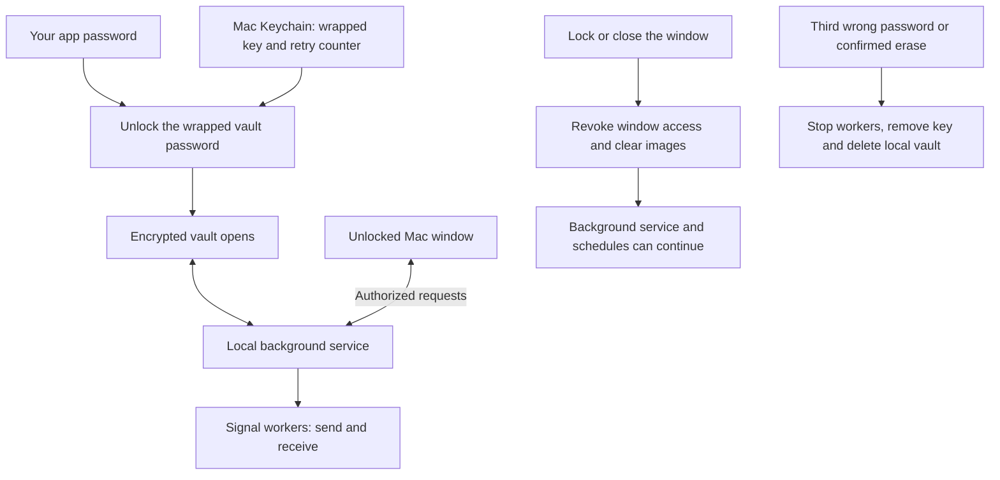

# Mac interface restoration and vault explanation

Date: 5 September 2026. Scope: the source-built macOS app.

## What caused the regression

Commit `0a84160` introduced the encrypted vault and changed the Mac launcher from
the established interface in `gui.py` to `mac_app.py`. The replacement kept basic
operations but omitted several customer controls. The photo strip still existed
in the old interface; the new app did not use it.

The security specification required authenticated access and protected storage.
It did not require removing photo arrangement or previews. The old thumbnail
renderer did need adaptation because it wrote readable image copies to a normal
temporary directory.

## Restored and improved in this change

- Numbered thumbnails, dragging into send order, Earlier/Later controls, removal,
  and larger previews through double-click or the Preview button.
- A scrolling photo area so large albums do not push Send below the window.
- Memory-only PNG/JPEG/HEIC decoding through Apple's ImageIO. Image paths travel
  to the helper through stdin, not process arguments. Locking closes previews,
  clears image references and queued results, and kills pending decoders.
- A moving activity indicator, elapsed time and friendly progress messages.
  The indicator means the operation is still active; it is not a delivery receipt.
  Progress and Stop/Cancel remain visible when changing tabs. Photo imports also
  show progress and disable Send until their callbacks finish.
- Explicit Ready, Sending, Stopping, Stopped, Finished and Failed states. A stop
  acknowledgement is produced only after the service's worker teardown succeeds.
  Failed teardown does not produce a Stopped event.
- Send and Save as the normal actions. Stop appears during sending. Resume and
  Discard appear only for an interrupted run. Destructive logout stays in Security
  and the lock screen rather than occupying the main header as well.
- Friendly recent activity instead of raw send-engine logs. Updates distinguish
  sent, skipped, failed and unconfirmed deliveries.
- Shared light/dark colours for readable photo and text panels.

Stopping affects the current operation. Saved schedules remain enabled, which the
screen explicitly reports. Already-dispatched messages may still arrive after Stop.

## Other functionality lost in the earlier rewrite

These are confirmed by comparing the controls in the legacy `gui.py` with the
protected app. This change restores the photo workflow and operation feedback;
the following omissions remain for a separate pass.

| Customer capability | Current limitation | Source comparison |
|---|---|---|
| Choose message formatting | The Mac app has no Normal/Bold/Italic/etc. picker. The engine and service still support a saved style. | `gui.App._build_send_tab`, `mac_service.Service.handle` settings |
| Retry only failed groups | No equivalent of the old Resend failed button. Resume handles an interrupted run, which is a different case. | `gui.App._on_resend`, `mac_worker.run` |
| Search groups and select all/none | The new Groups tab has individual toggles and Save but no search or bulk selection. This matters for large group lists. | `gui.App._build_groups_tab`, `mac_app.App.build_tabs` |
| Read a whole note before using it | The Notes tab shows an 80-character snippet and photo count. The old full-text pane, Copy text button and double-click shortcut are missing. Use as message still transfers the full text. | `gui.App._build_notes_tab`, `mac_app.App.use_note` |
| Update from inside the app | The Update button is gone. Customers must pull the repository and run Setup. | `gui.App._check_update`, `README.md` |
| See the last scheduled send | The old Schedule tab's last-send summary is absent. The service still exposes a saved run summary; this change shows results for completed operations during its lifetime. | `gui.App._build_schedule_tab`, `mac_service.Service.snapshot` |
| Manage diagnostic logging | The debug-log toggle and Open logs folder action are absent. Clear logs remains. | `gui.App._build_security_tab`, `mac_app.App.build_tabs` |
| Clear all attached photos at once | Customers can remove individual thumbnails, but the old Clear-all attachment action is absent. | `gui.App._build_send_tab`, `mac_app.App.build_tabs` |

The highest-priority remaining customer losses are group search/bulk selection,
failed-only retry, and the complete Notes preview. Restoring failed-only retry must
preserve the engine's treatment of unconfirmed deliveries to avoid duplicates.

The removals of wipe-on-quit and unplug-to-wipe were intentional requirements.
Manual locking replaced them. The unauthenticated Mac web interface was also
deliberately blocked. None of those decisions required removing the photo strip.

## What the vault does

The vault is an encrypted disk image stored under
`~/Library/Application Support/Signal Broadcast/data.sparsebundle`.
It contains this installation's Signal link keys, groups, notes, drafts, photos,
schedules and logs. The application code remains in the Git checkout.

1. Setup creates a random vault password. Your app password is used with Argon2id
   to derive a key that encrypts that random password with AES-GCM. The wrapped
   result and retry counter are stored in the local Mac Keychain.
2. Unlocking unwraps the random password and mounts the AES-256 encrypted APFS
   image. The local background service receives access to the files. The window
   receives a temporary authorization token for service requests.
3. Messages and schedules are handled by that service and its workers. Images
   selected for import are copied into the vault, verified, then removed from their
   selected original locations. Import is a move, and the confirmation says so.
4. Locking revokes the window's token and clears its visible content. The vault
   stays mounted so an existing broadcast and saved schedules can continue.
5. Restarting the service or the Mac requires another unlock before background
   schedules can run. Missed scheduled jobs are not automatically replayed.
6. Three consecutive wrong passwords, or confirmed Log out and erase, stop work,
   remove the wrapped vault key and delete the local vault and associated data.
   Failed cleanup remains pending and is reported. The phone and already-delivered
   messages are unaffected.



Locking the app therefore does not make the mounted files inaccessible to the
entire Mac account. The implementation explicitly is not protection against an
administrator, malware running as that user, modified application code, or restored
historical backups. FileVault remains relevant. Deleting a file is not a promise to
erase all historical copies or messages from other devices.

Implementation sources: `mac_security.password_key`, `wrap_password`,
`Vault.create_image`, `Vault.attach`, `Vault.migrate`, `Vault.import_image`,
`Vault.erase`, and `mac_service.Service.authenticate`, `lock`, `tick`, `erase`.

## Customer test handoff

When no broadcast is running, pull `main` and run `Setup.command` once. It compiles
the native thumbnail helper and restarts the service with status reporting.
Open the app and unlock normally. This update does not require erasing or relinking.

Check a multi-photo draft, drag its order, open a preview, then test a broadcast
against explicitly chosen test groups. Observe Sending, press Stop, and wait for
Stopped. Confirm the recipient state separately for any message dispatched before
the stop. This development work did not send live Signal messages or migrate or
erase customer data.

## Verification

Final combined run: **331 tests discovered, 325 passed, 6 optional native vault
integration checks skipped**, in 25.679 seconds.

```sh
SB_RUN_MAC_UI=1 SB_RUN_MAC_PHOTOS=1 SB_RUN_MAC_IPC=1 SB_RUN_MAC_PROCESSES=1 \
  .venv/bin/python -m unittest discover -s tests
```

The new native UI regression first failed because the replacement app had no photo
strip. It now passes real Tk thumbnail rendering, drag events, preview windows,
the ordered save/send request, animation movement, duplicate Stop prevention,
failed-stop feedback, confirmed Stop, stale-snapshot rejection, 15-photo layouts at
760×780 and 620×650, and image cleanup on lock.

Additional checks cover real PNG/JPEG/HEIC decoding, decoder cancellation and
timeouts, saved order after lock/unlock, a disposable worker exiting before Stopped
is recorded, and worker failures remaining distinct from successful completion.
Shell syntax, Python compilation and `git diff --check` passed.

The unchanged APFS/Keychain/launchd hardware integration suite was not repeated for
this interface change. No live Signal delivery, customer vault migration or
customer erasure was performed. The UI fixture and disposable service tests confirm
request and saved order; actual delivery order remains part of the recipient-side
customer test.
