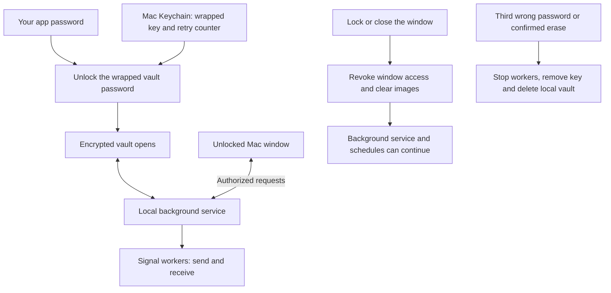

# Mac interface restoration and vault explanation

Date: 5 September 2026. Scope: the source-built macOS app.

## What caused the regression

Commit `0a84160` introduced the encrypted vault and changed the Mac launcher from
the established interface in `gui.py` to `mac_app.py`. The replacement kept basic
operations but omitted several customer controls. The photo strip still existed
in the old interface; the new app did not use it.

The security specification required authenticated access and protected storage.
It did not require removing photo arrangement or previews. The old thumbnail
renderer did need adaptation because it wrote readable image copies to a normal
temporary directory.

## Restored and improved in this change

- Numbered thumbnails, dragging into send order, Earlier/Later controls, removal,
  and larger previews through double-click or the Preview button.
- A scrolling photo area so large albums do not push Send below the window.
- Memory-only PNG/JPEG/HEIC decoding through Apple's ImageIO. Image paths travel
  to the helper through stdin, not process arguments. Locking closes previews,
  clears image references and queued results, and kills pending decoders.
- A moving activity indicator, elapsed time and friendly progress messages.
  The indicator means the operation is still active; it is not a delivery receipt.
  Progress and Stop/Cancel remain visible when changing tabs. Photo imports also
  show progress and disable Send until their callbacks finish.
- Explicit Ready, Sending, Stopping, Stopped, Finished and Failed states. A stop
  acknowledgement is produced only after the service's worker teardown succeeds.
  Failed teardown does not produce a Stopped event.
- Send and Save as the normal actions. Stop appears during sending. Resume and
  Discard appear only for an interrupted run. Destructive logout stays in Security
  and the lock screen rather than occupying the main header as well.
- Friendly recent activity instead of raw send-engine logs. Updates distinguish
  sent, skipped, failed and unconfirmed deliveries.
- Shared light/dark colours for readable photo and text panels.

Stopping affects the current operation. Saved schedules remain enabled, which the
screen explicitly reports. Already-dispatched messages may still arrive after Stop.

## Follow-up functionality restoration

The follow-up restores the omitted controls identified by comparing `gui.py` and
`mac_app.py` after commit `0a84160`:

- Update on the password screen and in the authenticated header, with Finish update for restart or Setup.
  Updates cannot interrupt a worker. A downloaded update pauses new manual jobs
  and scheduled jobs until installation/restart completes. Git failures are shown
  separately from an already-current result. Native helper, installer and dependency
  changes require Setup.
  The locked-screen updater only fetches app code; it does not open the vault.
  Public status exposes update flags, never Git diagnostics or private snapshots.
  Downloading keeps the current session. Finishing restarts the service and requires
  the local password again, while preserving the Signal link and saved data.
- Whole-message formatting saved with the draft.
- Failed-only retry, persisted inside the vault and tied to saved text, attachment
  order and formatting. Sent, skipped and unconfirmed recipients are excluded.
  An interrupted broadcast must be resolved first. The old retry list is cleared
  before dispatch so a crash cannot reuse successes from a preceding attempt.
- Group search and select/deselect visible matches. Saving retains hidden selections.
- Complete note text, Copy text and double-click to use it. Incomplete notes remain
  blocked from use; selecting a note survives list refresh by timestamp.
- Persisted last-send counts on Schedule and Clear all photos on Send.
- Photo-control help explaining send order and removal from the current message.
- Actual active-send and completed-group counts. Completion counts stay monotonic
  when parallel workers finish out of order. Preparing continues until dispatch
  starts, with animation indicating active work rather than successful delivery.
- Send and Save positioned ahead of the draft so large albums cannot hide them.

The user-visible activity/logs box and logging controls are unchanged in this
follow-up, as requested. Diagnostic controls omitted by the earlier rewrite remain
outside this restoration. Existing failed runs without the new retry record cannot
be reconstructed as a failed-only retry.

The removals of wipe-on-quit and unplug-to-wipe were intentional requirements.
Manual locking replaced them. The unauthenticated Mac web interface was also
deliberately blocked. None of those decisions required removing the photo strip.

## What the vault does

The vault is an encrypted disk image stored under
`~/Library/Application Support/Signal Broadcast/data.sparsebundle`.
It contains this installation's Signal link keys, groups, notes, drafts, photos,
schedules and logs. The application code remains in the Git checkout.

1. Setup creates a random vault password. Your app password is used with Argon2id
   to derive a key that encrypts that random password with AES-GCM. The wrapped
   result and retry counter are stored in the local Mac Keychain.
2. Unlocking unwraps the random password and mounts the AES-256 encrypted APFS
   image. The local background service receives access to the files. The window
   receives a temporary authorization token for service requests.
3. Messages and schedules are handled by that service and its workers. Images
   selected for import are copied into the vault, verified, then removed from their
   selected original locations. Import is a move, and the confirmation says so.
4. Locking revokes the window's token and clears its visible content. The vault
   stays mounted so an existing broadcast and saved schedules can continue.
5. Restarting the service or the Mac requires another unlock before background
   schedules can run. The scheduler now combines missed times into one pending send
   with a one-hour lateness limit. A previously dispatched run is never replayed
   automatically. See `MAC-SCHEDULE-RELIABILITY.md`.
6. Three consecutive wrong passwords, or confirmed Log out and erase, stop work,
   remove the wrapped vault key and delete the local vault and associated data.
   Failed cleanup remains pending and is reported. The phone and already-delivered
   messages are unaffected.



Locking the app therefore does not make the mounted files inaccessible to the
entire Mac account. The implementation explicitly is not protection against an
administrator, malware running as that user, modified application code, or restored
historical backups. FileVault remains relevant. Deleting a file is not a promise to
erase all historical copies or messages from other devices.

Implementation sources: `mac_security.password_key`, `wrap_password`,
`Vault.create_image`, `Vault.attach`, `Vault.migrate`, `Vault.import_image`,
`Vault.erase`, and `mac_service.Service.authenticate`, `lock`, `tick`, `erase`.

## Customer test handoff

When no broadcast is running, pull `main` and run `Setup.command` once. It compiles
the native thumbnail helper and restarts the service with status reporting.
Open the app and unlock normally. This update does not require erasing or relinking.

Check a multi-photo draft, drag its order, open a preview, then test a broadcast
against explicitly chosen test groups. Observe Sending, press Stop, and wait for
Stopped. Confirm the recipient state separately for any message dispatched before
the stop. This development work did not send live Signal messages or migrate or
erase customer data.

## Verification

Full suite: **342 tests discovered, 336 passed, 6 optional hardware integration
checks skipped**. The final skipped-first-send progress adjustment also passed all
11 focused restoration tests. Python compilation and `git diff --check` passed.

The regression suite includes disposable service tests for formatting persistence,
retry eligibility, update/schedule exclusion, guarded restart and progress
persistence across locking. Simulated sends verify out-of-order completion counts
and clearing stale retry recipients before dispatch.

Native Tk tests cover the update control, formatting save, complete note text,
filtered group selection, actual concurrency labels, tooltip cleanup, thumbnail
rendering, dragging, previews, Stop handling, animation and Send/Save visibility at
760×780 and 620×650. No live Signal sends or customer vault changes were performed.
The optional APFS/Keychain/launchd integration suite was not repeated.

Run with:

```sh
SB_RUN_MAC_UI=1 SB_RUN_MAC_PHOTOS=1 SB_RUN_MAC_IPC=1 SB_RUN_MAC_PROCESSES=1 \
  .venv/bin/python -m unittest discover -s tests
```
